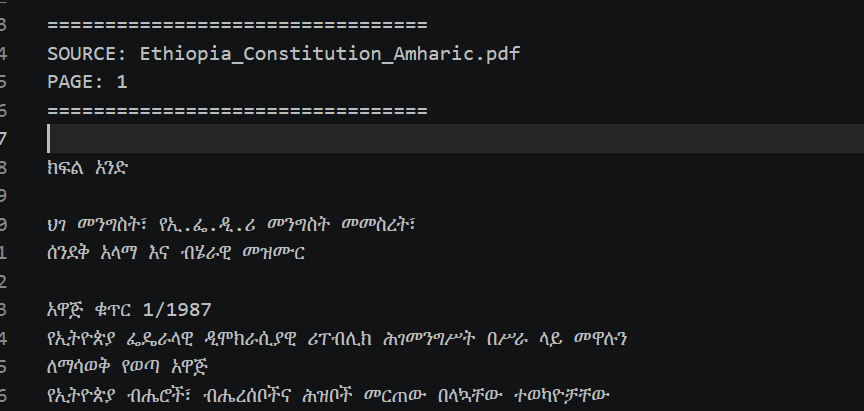
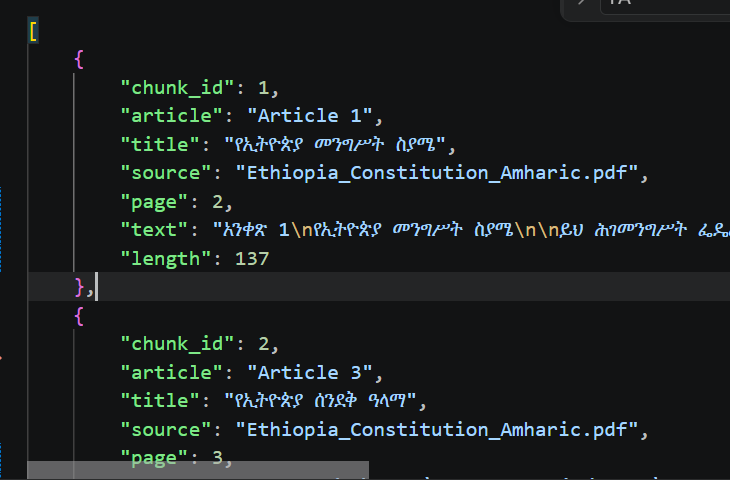

# Task 1: Ethiopian Legal PDF Inspection and Text Extraction

## Objective

The objective of this task was to inspect Ethiopian legal PDF documents and extract legal text using appropriate PDF processing and OCR methods. The extracted data will be used for legal document search, embeddings, and RAG-based question answering.

---

## PDF Inspection

### 1. Amharic Constitution PDF

- **Document:** FDRE Constitution (Amharic)
- **Language:** Amharic
- **PDF Type:** Scanned/Image-based PDF
- **Text Layer:** Not reliably available
- **Extraction Method:** Tesseract OCR
- **OCR Language:** amh + eng

**Observation:**

- Pages were converted into images before OCR processing.
- Tesseract successfully extracted Amharic legal text.
- Some OCR errors occurred due to character similarity and scan quality.
- Article numbers were partially preserved and verified.

---

### 2. English Constitution PDF

- **Document:** FDRE Constitution (English)
- **Language:** English
- **PDF Type:** Digital PDF
- **Text Layer:** Available and selectable
- **Extraction Method:** PyMuPDF

**Observation:**

- Direct extraction produced high-quality text.
- Article numbers and legal structure were preserved correctly.
- No major recognition errors were observed.

---

# Extraction Method Comparison

| Document | Method | Language | Article Number Preservation | Readability |
|---|---|---|---|---|
| Amharic Constitution PDF | Tesseract OCR | amh + eng | Partial | Medium |
| English Constitution PDF | PyMuPDF Direct Extraction | eng | Yes | High |

---

# Final Extraction Approach

A hybrid extraction method was selected:

                 PDF Document
                      |
                      ▼
              Check Text Layer
                      |
          ┌───────────┴───────────┐
          │                       │
          ▼                       ▼
     Digital PDF             Scanned PDF
          │                       │
          ▼                       ▼
   PyMuPDF Direct          Convert Pages to Images
    Extraction                    |
          │                       ▼
          │                 Image Preprocessing
          │          (Grayscale, Threshold, Resize)
          │                       |
          │                       ▼
          │              Tesseract OCR
          │              (amh + eng)
          │                       |
          └───────────┬───────────┘
                      ▼
              Raw Extracted Text
                      |
                      ▼
              Text Cleaning
        (Remove Noise, Preserve Articles)
                      |
                      ▼
          Article-level Chunking
          (article_chunks.json)
                      |
                      ▼
          Document Embeddings
      (Sentence Transformer Model)
                      |
                      ▼
             FAISS Vector Index
                      |
                      ▼
          Semantic Search / Top-K Retrieval
                      |
                      ▼
              RAG Question Answering
                (Gemini LLM)
---
## Three-Page Extraction Evaluation

| Page | Method | Language | Article Numbers | Readability | Major Errors | Rating |
|---|---|---|---|---|---|---|
| Clear page | Tesseract OCR | Amharic | Yes | High | Minor character errors | 4/5 |
| Low-quality page | Tesseract OCR | Amharic | Partial | Medium | Character confusion, noise | 3/5 |
| Article structure page | Tesseract OCR | Amharic | Yes | High | Minor formatting issues | 4/5 |

## OCR Cleaning Example

Before Cleaning:

አንቀጽ 25
የእኩልነት መብት
PAGE: 12
========

After Cleaning:

አንቀጽ 25
የእኩልነት መብት

ሁሉም ሰዎች በሕግ ፊት እኩል ናቸው...

## Source Code

The extraction implementation includes:

- PDF text extraction using PyMuPDF
- OCR processing using Tesseract
- Image preprocessing
- Article-level text extraction
- JSON chunk generation

Generated output:

data/chunks/article_chunks.json

 ## Screenshoots
 a. article_chunks.json
 
b.OCR Output
 

# Justification

The hybrid approach was selected because it supports both digital and scanned Ethiopian legal documents.

Advantages:

- Handles different PDF formats.
- Preserves legal article numbers.
- Supports Amharic OCR processing.
- Produces clean text for embeddings and semantic search.
- Suitable for the Ethiopian Legal & Justice AI Assistant RAG pipeline.

---

# Conclusion

PyMuPDF was selected for digital PDFs because it provides accurate text extraction. Tesseract OCR was selected for scanned Amharic legal documents because it supports Amharic language recognition. Combining both methods provides a reliable extraction pipeline for Ethiopian legal documents.